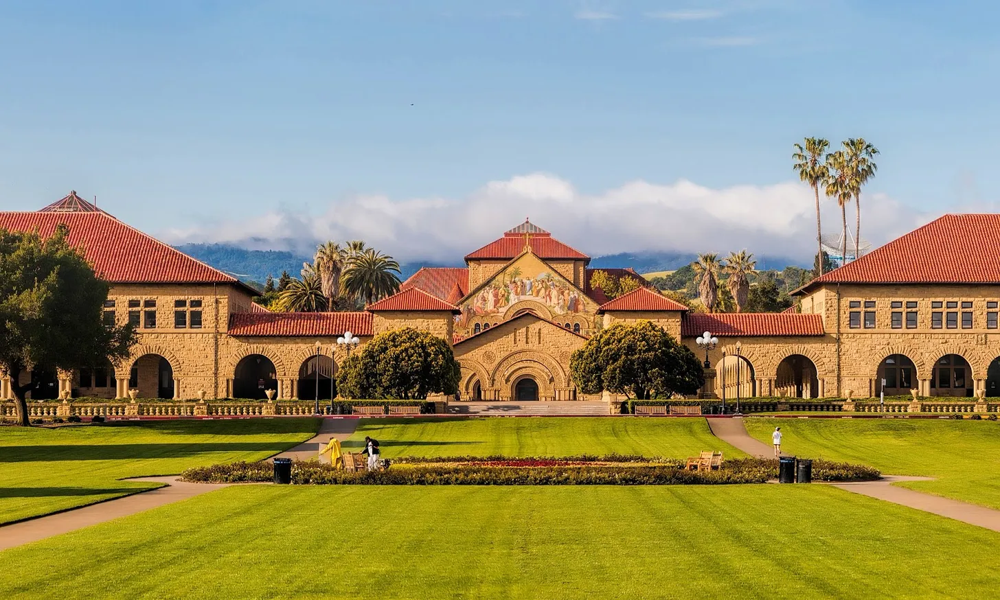

I woke up this morning with this crazy idea and I decided to write about it, without too much research. and without having the article reviewed. I am so convinced that I just had an urge to write it and publish it. Just like that.

Living like a Google doesn't really mean much, I know.

So let me explain.

Google started as a fun venture of two friends. Studying for their PhDs at Stanford.

We probably all know some parts of the story. Larry Page and Sergey Brin found what today anyone would call product market fit while building a product they thought would be useful to everyone and that would make the world they lived in a better place.

They were driven by a mission. A vision. Their vision was to make the internet easier to navigate, not to build an advertising giant.

Here is the full story:

[Google story](https://www.theverge.com/2019/12/4/20994361/google-alphabet-larry-page-sergey-brin-sundar-pichai-co-founders-ceo-timeline)

Steve Jobs, 20 years earlier, did more or less the same. I can see him walking and wondering around the Stanford campus, or, later, in his parents’ living room: "I like computers, I know everything about computers, but I need to make money... so... let me think... who will buy the pieces of computers that my friend Woz and I can make?... ah the computer store down the road wants full computers and not just parts of them?!, Sure! we will do that, we will make money".

Although nobody knows for sure what he had in mind, and certainly I don't know, his vision was probably very simple, he believed programming and computers would change the world and he wanted to be part of that.

Only much later did he came up with his famous vision that "every home will have a personal computer".

---

Back to Google, I can imagine Sergey talking to Larry in some Stanford garden, more or less in the same tone: "we like coding, we can't find stuff on the internet, let's see if we can build something that helps people to find easily stuff online". A few months later they realized (or were pushed to realize) that they could make money out of it. It wasn't intentional at first.

And it's not just Google. Plenty of other entrepreneurs followed a similar path. They were doing stuff for the sake of it. Or for curiosity. Or beliefs.

And this is my take on what Steve Jobs refers to when he says follow your passion. It is very different from saying "do stuff to make money that involves what you are good at".

These visionary entrepreneurs ended up building products while pursuing their personal curiosity and were most likely not thinking about what the outcome would have been while at it. In addition, we will never know how many other ideas they had tried before the successful ones. But I am ready to bet that most of those ideas were somewhat aligned with their curiosities.

Reality is, they were not just building products, they were not building a career, they were writing their own life story.

In the case of Google and Apple, it happened to be an incredibly rewarding life story. When applied to work, I call Life stories a career path.

These three entrepreneurs wrote their life stories and ended up also building amazing careers. So many others, like them, were lucky enough to build a similar career path. And it doesn't need to be some entrepreneurial work, it doesn't need to be anything in particular.

All it requires, to be a true life story turned career path, is that it is born out of a genuine interest in something and that it drives decisions throughout life.

This of course is not true for all successful entrepreneurs, or successful artists, managers, and doctors. But it certainly is true for these legendary people who shape our current world and many more like them.

---

A life story ultimately is what will drive anyone for all their lives. A life story is the glue that will hold anyone together when a product or a job won't work anymore.

And a clear and strong life story has so many benefits!

The main one, and here is my main point, is that it allows anyone to become a portfolio of products. Just like Google. A single-person multinational. A "multi-preneur"!

Whatever they do, whatever activity, business, job, or venture is going to make sense as it goes back to that life story.

Life stories are more relevant and more impactful than passion, skills, or even goals and missions. Those are "plot". A life story is The story. It is what drives the protagonist ahead. And it's made of a beginning, an inciting incident, a mission, some complications, a solution (hopefully!), and an end (for sure...). Everyone should think about his life story before coming up with the plot. The plot is what happens IN the life story. It's not the story.

A little reminder of this plot vs story:

[Masterclass: Plot vs Story](https://www.masterclass.com/articles/plot-vs-story)

---

Both Google and Apple, among many others, are run as a portfolio of products.

There you have it, this is what I meant. These companies really are like holding companies with a bunch of subsidiaries. Extremely connected to each other.

They are run as Products Operating Model. Read Marty Cagan amazing article on this:

[Product Operating model](https://www.svpg.com/the-product-operating-model/)

Both Google and Apple have the strength to launch, test, develop, or cancel products continuously.

Some of these products are very expensive, some others are free, or are free for some and paid for others. Some products are physical, some are digital. They all cater to different needs. Yet, they are all connected and share a common purpose.

CONCLUSION

I argue that we should learn to live like Google, I think everyone can BE a little portfolio of products. A multi-preneur. Maybe with one revenue stream, perhaps more than one, but certainly with several products (and services) that all contribute to an overall result: your life story. Productize yourself. Follow your life story, live like a Google.
